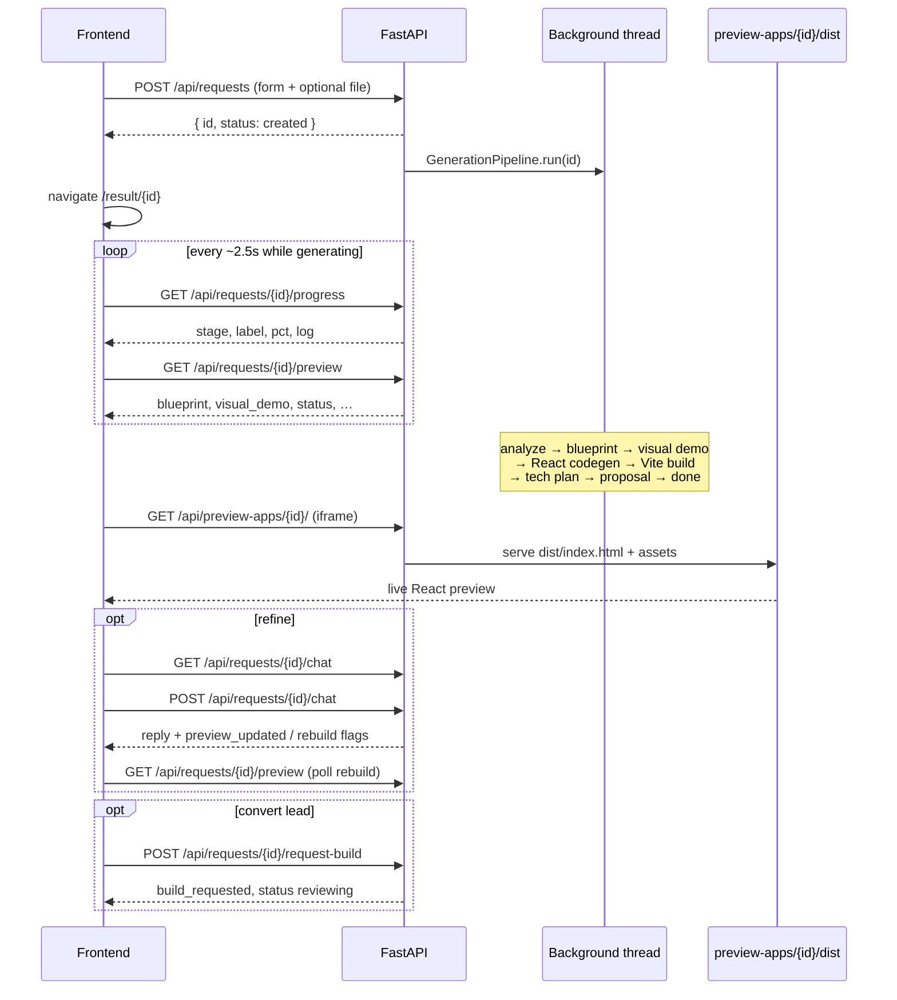

# Backend structure

FastAPI service that turns a business intake form into an AI-generated MVP blueprint and a live React preview. This is the **sales / demo generator** — not the multi-tenant product backend (`bmv-core/`).

## Top-level layout

```
backend/
├── app/                  # Application code (import root: `app`)
├── preview-template/     # Vite + React scaffold copied into each preview workspace
├── data/                 # Seed fixtures (e.g. PlateSync demo)
├── tests/                # Pytest suite (appspec, preview_app, infrastructure)
├── scripts/              # Ops / CLI helpers (not part of the API)
│   ├── cli/              # Recurring tools
│   ├── ops/              # Migrations + seeding
│   └── archive/          # Historical one-offs
├── pytest.ini
├── requirements.txt
├── .env.example
└── ARCHITECTURE.md       # This file
```

**Canonical preview scaffold:** `backend/preview-template/` only. Docker and Render set `PREVIEW_TEMPLATE_DIR` here. Do not add a second copy at the repo root.

## Layered packages (`app/`)

Clean architecture style. Dependencies point **inward**: API → application → domain; infrastructure implements domain interfaces.

| Package | Role |
|---------|------|
| `app/main.py` | App factory: DB bootstrap, CORS, mount routers, optional SPA static files |
| `app/core/` | Settings (`config.py`) — env, paths, AI models, preview limits |
| `app/api/` | HTTP only: routers, deps. No business logic |
| `app/application/` | Use cases: generation pipelines, preview codegen, services |
| `app/domain/` | Models, Pydantic schemas, AI/template interfaces |
| `app/infrastructure/` | SQLAlchemy, OpenRouter/Ollama, Jinja2, file storage, URL scrape |
| `app/templates/` | Jinja2 prompts + codegen/page templates |
| `app/data/` | Static catalogs (e. of AI feature catalog) |
| `app/shared/` | Small shared helpers |
| `app/uploads/` | Runtime uploads + built preview apps (gitignored content) |

### `api/` — HTTP surface

```
api/
├── deps.py                 # Shared FastAPI dependencies
└── v1/
    ├── api_router.py       # Single mount point for main.py
    └── routers/
        ├── health.py
        ├── auth.py
        ├── requests.py     # Intake, progress, chat, trigger generation
        ├── preview_apps.py # Serve built preview static assets
        ├── demos.py
        ├── admin.py
        └── solution_workspaces.py
```

Routers stay thin: validate input, open a DB session, call application code, return schemas.

### `application/` — business flows

```
application/
├── appspec/                # AppSpec generation, coverage, projection, persistence
├── pipelines/              # End-to-end “new request → finished preview”
│   ├── orchestrator.py     # GenerationPipeline.run() — step order + progress
│   ├── reference_analysis.py
│   ├── blueprint.py
│   ├── visual_demo.py
│   ├── role_pages.py       # HTML fallback if React preview fails
│   ├── technical_plan.py
│   ├── proposal.py
│   └── _shared.py
├── preview_app/            # React preview: plan → codegen → Vite build → serve
│   ├── pipeline/           # Phased generate_preview_app (gate→plan→codegen→polish→build→finalize)
│   ├── codegen/            # AI file generation, mock synth, critique, fix agent
│   ├── safety/             # Workspace guards (invoked by pipeline, not by codegen)
│   ├── catalogue_contract/ # Slot/tokenize/bindings/validate/scaffold/repair for catalogue pages
│   ├── text_utils.py       # Shared fence/JSON helpers (neutral)
│   ├── source_quality.py   # Truncation / apostrophe heuristics (neutral)
│   ├── mock_imports.py     # Collect mock.ts import names (neutral)
│   ├── patterns.py         # Shared regex/constants leaf module
│   ├── deterministic_repairs.py  # Post-fix-agent safety repairs outside codegen
│   ├── workspace.py        # Copy template → PREVIEW_APPS_DIR/{id}/
│   ├── assemble.py         # App.tsx, CSS, mock plumbing
│   ├── build.py            # npm install + vite build
│   ├── fallback.py         # Stubs only after AI retries
│   ├── chat_refinement.py  # Thin shim → refinement/ (back-compat re-exports)
│   ├── refinement/         # Post-preview chat edits (AppSpec ctx, intent, patch, rebuild)
│   ├── screenshot.py
│   └── parallel.py
└── services/               # Reusable helpers (progress, auth, page QA, demos, …)
    └── preview_refinement.py  # Chat API facade (history + refine_preview)
```

### `domain/` — contracts and data shapes

```
domain/
├── appspec/                # Pure AppSpec sanitize + validation packages
│   ├── sanitize/           # kinds, structure, evidence, journeys, alignment, pipeline
│   └── validation/         # models, ids, membership, effects, journeys, acceptance, …
├── models/                 # SQLAlchemy entities (Request, User, SolutionWorkspace, …)
├── schemas/                # Pydantic request/response models
└── interfaces/             # AIProvider, TemplateRenderer (implemented in infrastructure)
```

### `infrastructure/` — adapters

```
infrastructure/
├── db/             # engine, session, migrations, Base
├── ai_providers/   # factory → OpenRouter or Ollama (+ retry)
├── templating/     # Jinja2 renderer for prompts/codegen
├── storage/        # Upload dir helpers
├── logging/        # Structured logging, diagnostics dumps
└── web/            # Reference URL scraper
```

### `templates/` — prompt and codegen source

| Folder | Used for |
|--------|----------|
| `templates/prompts/` | LLM system/user prompts (`.j2`) |
| `templates/codegen/` | React file skeletons the model fills in |
| `templates/pages/` | Legacy HTML role-page bundles |

## Endpoint-to-endpoint flow (main product path)

This is the path the frontend actually walks. One create call starts everything; the rest are polls and follow-ups. Generation itself is **not** a chain of HTTP calls between backend endpoints — it runs in a **background thread** after create returns.



### Step by step

| # | Endpoint | Who calls it | What happens next |
|---|----------|--------------|-------------------|
| 1 | `POST /api/requests` | Submit wizard | Saves `Request` row, optional upload + URL scrape. Starts `GenerationPipeline` on a **daemon thread**. Returns `{ id }` immediately. |
| 2 | Frontend navigates to `/result/{id}` | — | No API call; UI opens the result page. |
| 3 | `GET /api/requests/{id}/progress` | Result page (poll ~2.5s) | Reads `generation_log` JSON written by `progress.emit()` inside the pipeline. Stages: `analyze` → `blueprint` → `demo` → `codegen` / `architect` / `critic` → `build` → `tech` → `proposal` → `done` (or `failed`). |
| 4 | `GET /api/requests/{id}/preview` | Result page (poll) | Returns whatever is already on the row: blueprint, visual demo, pages, scores. `is_generating` stays true until progress stage is terminal (`done` / `failed` / `ready`) — not merely until blueprint exists. |
| 5 | *(inside the same background job)* | Pipeline, not HTTP | Order in `orchestrator.py`: reference analysis → MVP blueprint → visual demo → **`generate_preview_app`** (copy template, AI files, Vite build) → technical plan → proposal → emit `done`. |
| 6 | `GET /api/preview-apps/{id}/…` | iframe / browser | Serves static files from `PREVIEW_APPS_DIR/{id}/dist`. This is how the live React demo is shown. |
| 7 | `GET /api/requests/{id}/chat` | Refine chat panel | Loads prior refine messages. |
| 8 | `POST /api/requests/{id}/chat` | User sends a message | `refine_preview` may edit blueprint/demo and/or rebuild the preview app. Response flags `preview_updated` / `preview_rebuild_started`; UI re-polls **preview** (and the iframe reloads when dist is ready). |
| 9 | `POST /api/requests/{id}/request-build` | “Build this” CTA | Stores contact info, sets `build_requested`, status → `reviewing`. Hand-off to humans/admin — does **not** start more AI. |

### Retry / partial re-runs (same request id)

| Endpoint | When |
|----------|------|
| `POST /api/requests/{id}/retry-generation` | Stuck/failed before blueprint exists — restarts full `GenerationPipeline`. |
| `POST /api/requests/{id}/generate-preview-app` | Blueprint exists; re-run React preview only (background, per-request lock). |
| `POST /api/requests/{id}/generate-pages` | Blueprint exists; re-run HTML role-pages fallback only. |

These are optional; the happy path does **not** need them — create already runs the full pipeline.

### Admin path (manual step control)

Admin UI uses a different router. Login first, then operate on the same `Request` rows:

1. `POST /api/admin/login` → session/password for later calls  
2. `GET /api/admin/requests` → list  
3. `GET /api/admin/requests/{id}` → detail  
4. Optional one-shot steps:  
   `…/analyze-screenshot`, `…/generate-blueprint`, `…/generate-visual-demo`,  
   `…/generate-technical-plan`, `…/generate-proposal`  
5. Or `POST /api/admin/requests/{id}/generate-full` → same `GenerationPipeline.run()` as create, but **synchronous** in that HTTP request  
6. `PATCH /api/admin/requests/{id}` → status / notes  
7. `GET /api/admin/requests/{id}/whatsapp-message` → copy for outreach  

Admin does not replace the public create → progress → preview → chat flow; it is for operators.

### Other routers (side paths)

| Area | Endpoints | Role in the journey |
|------|-----------|---------------------|
| Health | `GET /api/health`, `GET /api/ai/status` | Ops / banner — not part of generation |
| Auth | `POST /api/auth/signup\|login`, `GET /me`, `POST /logout` | Solutions / showcase accounts |
| Demos | `GET /api/demos` | Seeded showcase list |
| Solutions | `/api/solutions/{id}/workspace`, catalog integrate, chat | Edit overlay on industry showcases — separate from AI preview generation |

### Important design note

**Endpoints do not call each other.**  
`POST /api/requests` returns, then a thread runs the pipeline and writes DB + disk. The UI discovers progress by polling **progress** and **preview**, then loads the built app from **preview-apps**. Chat and request-build are later steps on the same `request_id`.

## Quality bar (Lovable-grade demos)

Runtime enforcement so demos feel like real products — not just “build succeeded”:

| Rule | Behavior |
|------|----------|
| Critics on | `PREVIEW_SKIP_CRITIC` and `PREVIEW_SKIP_VISUAL_CRITIC` default **false** (set true only for fast local iteration) |
| Routes complete | Every planned route gets a page file and is wired in `App.tsx`; unresolved routes are AI-retried then stubbed |
| File cap | Under `PREVIEW_MAX_FILES`, **pages are prioritized** over chrome extras; skips are logged |
| Rich mocks | Missing/empty mock exports get 3–6 seeded rows — never `[]` |
| Honest stubs | Last-resort stubs are industry-aware and listed in `preview_app.fallback_pages` |
| Refine recoverability | Failed chat rebuilds keep the last good `dist` + `url`, set `last_refinement_error`, and show a banner — iframe does not disappear |
| Shared npm | Deps install once into `PREVIEW_APPS_DIR/_shared_npm/<lock-hash>/` and are junctioned/symlinked into each workspace — no full `npm install` per demo |

**Share demo:** Owners use **Share demo** on `/result/{id}` to copy `/share/{id}` — a clean viewer (no refine chat). Same preview API; no token required yet.

**Roadmap (later):** private share tokens / expiry; role walkthrough mode.

## Config and runtime paths

| Setting | Purpose |
|---------|---------|
| `DATABASE_URL` | SQLite locally; Postgres-compatible URL in some deploys |
| `AI_PROVIDER` | `openrouter` (default) or `ollama` |
| `PREVIEW_TEMPLATE_DIR` | Scaffold root — Docker/Render: `./preview-template` under `backend/` |
| `PREVIEW_APPS_DIR` | Built apps (default under uploads) |
| `UPLOAD_DIR` | Screenshots / reference files |
| `STATIC_DIR` | Optional: serve the Vite frontend from the same process |
| `PREVIEW_SKIP_CRITIC` | Default `false` — skip text design critic when `true` |
| `PREVIEW_SKIP_VISUAL_CRITIC` | Default `false` — skip screenshot vision critic when `true` |

See `.env.example` for the full list.

## Scripts and data

- **`scripts/cli/`** — recurring tools (rebuild/finish preview, poll progress, parse debug logs).
- **`scripts/ops/`** — migrations and seeding helpers.
- **`scripts/archive/`** — historical one-offs; prefer not to run.
- **`tests/`** — pytest suite (`pytest` from `backend/`).
- **`data/`** — JSON / prebuilt dist used to seed demos (e.g. PlateSync).

## Where to change what

| Goal | Start here |
|------|------------|
| New HTTP endpoint | `app/api/v1/routers/` + register in `api_router.py` |
| Generation step order | `application/pipelines/orchestrator.py` |
| Preview quality / prompts | `templates/prompts/preview_app_*.j2` + `preview_app/codegen/` |
| Build / Node / template path | `preview_app/workspace.py`, `build.py`, `core/config.py` |
| AI provider switch | `infrastructure/ai_providers/factory.py` + env |
| DB schema | `domain/models/` + `infrastructure/db/migrations.py` |

## Relation to the rest of the monorepo

| Path | Role |
|------|------|
| `frontend/` | Product UI (form, progress, iframe, chat) |
| `backend/` | This service — AI demo generation |
| `bmv-core/` | Separate real multi-tenant SaaS backend (not called by this API yet) |
